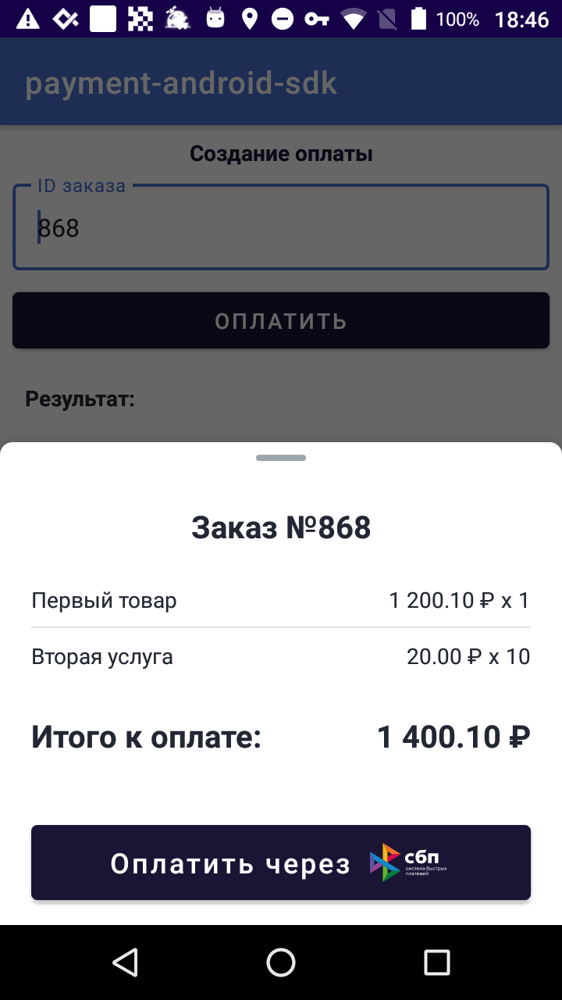
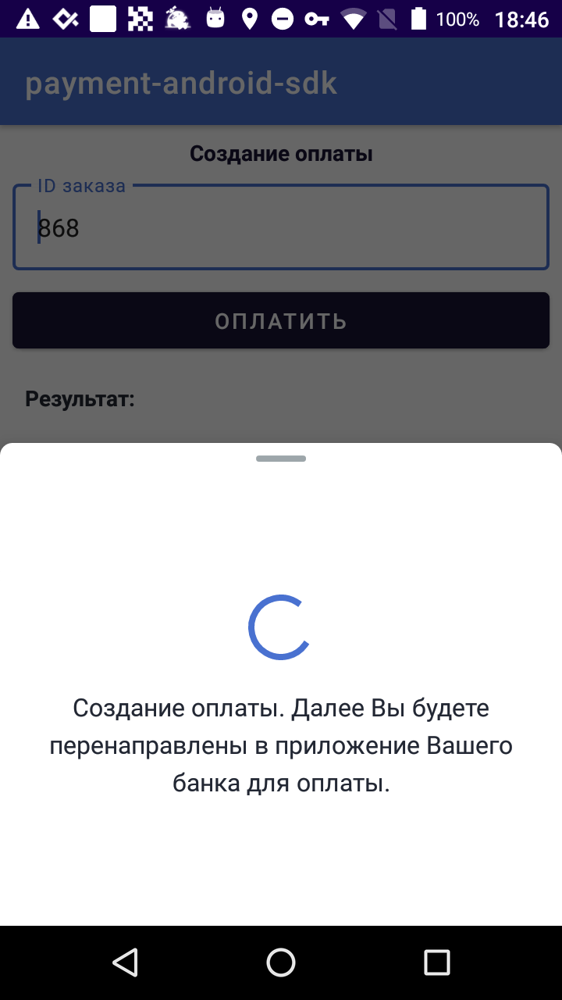

# Payment Android SDK
#### SDK для оплаты в мобильных приложениях

 

Payment Android SDK позволяет интегрировать [интернет-эквайринг Modulbank][acquiring] в мобильные приложения для платформы Android.

Возможности SDK:
- Прием СБП-платежа;
- Получение информации о проведенных платежах;
- Интеграция с онлайн-кассами;

### Требования
Для работы Payment Android SDK необходим Android версии 6.0 и выше (API level 23).

### Интеграция
Для проведения платежей посредством [интернет-эквайринга Modulbank][acquiring] необходимо получить в личном кабинете:
- идентификатор мерчанта;
- секретный ключ подписи.

Подробнее о получении ключей можно прочитать [тут][keys].

Для локальной сборки демо приложения необходимо добавить файл `local.properties` в корень проекта и вписать в него выданные ключи следующим образом:
```properties
client.merchantId=<your merchant id>
client.signatureKey=<your signature>
```

### Пример использования
Пример подключения и работы с SDK представлен в модуле payment-demo проекта.

Работа с SDK ведется через клиента **ModulPaymentClient**, который необходимо создать в корне клинетской activity и сразу же зарегистрировать callback на оплату. Необходимость регистрации callback оплаты в корне activity обусловлена механизмом получения результата оплаты через [ActivityResult][activity_result].
```kotlin
private val modulPaymentClient = ModulPaymentClient().apply {
    registerPaymentResultCallback(this@MainActivity) { result: PaymentResult ->
        when (result) {
            is PaymentResultSuccess -> {
                // обработка успешного результата платежа
            }
            is PaymentResultError -> {
                // обработка ошибочного результата платежа
            }
        }
    }
}
```

Также клиента необходимо проинициализировать выдаными ключами идентификатора мерчанта и подписи.
```kotlin
modulPaymentClient.init(
    this,
    merchantId = BuildConfig.MERCHANT_ID,
    signatureKey = BuildConfig.SIGNATURE_KEY
)
```

Для проведения оплаты по СБП необходимо вызвать метод **ModulPaymentClient**#_payBySbp_, передав в качестве аргумента сформированные данные для оплаты в формате:
```kotlin
PaymentOptions.createSbpOptions(
    orderId = orderId,                              // Уникальный идентификатор заказа в интернет-магазине
    description = "Заказ №$orderId",                // Описание платежа
    amount = BigDecimal.valueOf(1400.10),           // Сумма платежа. Необязательное, если переданы позиции для платежа
    positions = listOf(                             // Список позиций для платежа
        Position(
            name = "Первый товар",                  // Наименование товара/услуги
            price = BigDecimal.valueOf(1200.10),    // Цена товара
            quantity = BigDecimal.ONE,              // Количество товара
            type = PositionType.COMMODITY           // Предмет расчета
        ),
        Position(
            name = "Вторая услуга",
            price = BigDecimal("20"),
            quantity = BigDecimal.TEN,
            type = PositionType.SERVICE
        )
    ),
    receiptContact = "example@mail.ru"              // Еmail получателя чека. Если включена фискализация, необязательное
)
```
Подробнее о полях и их валидации можно почитать [тут][sbp_link] и [тут][receipts].
Если у клиента включена фискализация чеков в личном кабинете и в заказе передан список позиций, после успешной оплаты чек заказа будет фискализирован.
У позиции выставлены по умолчанию система налогооблажения = ОСН, метод платежа = полный расчет, ставка НДС = 20%

Процесс оплаты выглядит следующим образом:
- Клиент передает параметры платежа SDK;
- SDK показывает bottomsheet диалог с деталями платежа, пользователь их подтвержает по кнопке "Оплатить";
- SDK формирует СБП ссылку на оплату и передает установленному на устройстве банковскому приложению данные платежа;
- Клиент проводит СБП платеж в своем банковском приложении;
- По возвращению в исходное приложение, SDK запрашивает результат оплаты и отдает ответ.

Успешный результат оплаты придет в формате **PaymentResultSuccess** с полями:
- transactionId: String - идентификатор транзакции в системе эквайринга Modulbank
- sbpTransactionId: String - идентификатор транзакции от НСПК

Ошибочный результат оплаты придет в формате **PaymentResultError** с полями:
- message: String - описание ошибки
- type: ErrorType - тип ошибки, возможные значения INVALID_DATA (Данные запроса невалидны), CANCELLED (Операция была отменена пользователем), FAILED (Операция завершилась с ошибкой).
- cause: String - причина ошибки

Для запроса результата оплаты необходимо вызвать метод **ModulPaymentClient**#_getPaymentResult_, передав в качестве аргумента идентификатор заказа, по которому был проведен платеж. Ответ вернется в том же формате, что при оплате.

[acquiring]: https://modulbank.ru/support/payment_gateway_api
[activity_result]: https://developer.android.com/training/basics/intents/result
[sbp_link]: https://modulbank.ru/support/getting_qr_code_or_link_sbp_payment
[receipts]: https://modulbank.ru/support/sending_receipts
[keys]: https://modulbank.ru/support/ie_keys